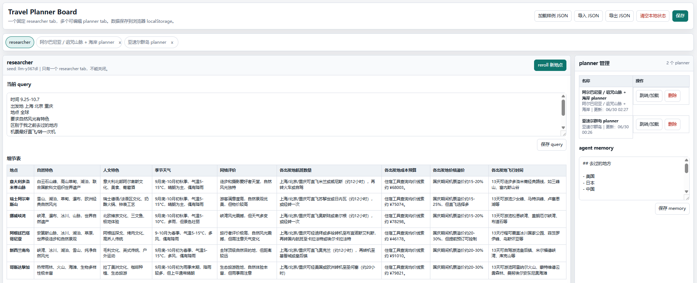
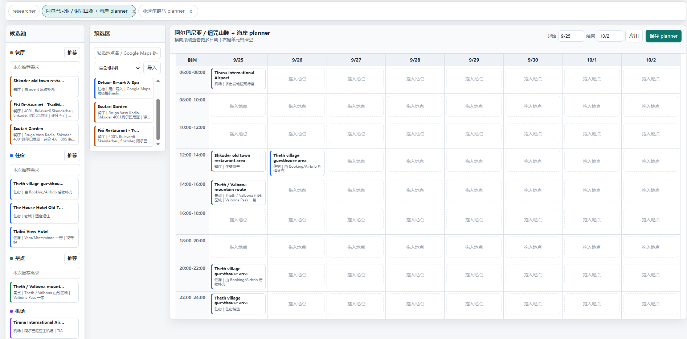
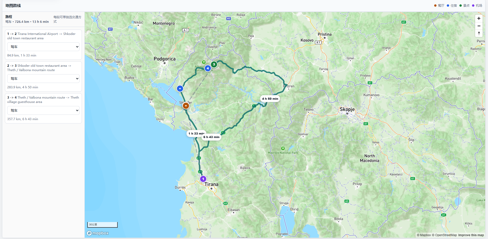

# Travel Agent ✈️

<p>
  <a href="README.md"><strong>English</strong></a>
  &nbsp;|&nbsp;
  <a href="docs/zh/README.md"><strong>中文</strong></a>
  &nbsp;|&nbsp;
  <a href="docs/index.html"><strong>Docs</strong></a>
</p>

Travel Agent is a local-first, agent-driven travel planning workspace. It helps a trip organizer move from open-ended destination research to editable itinerary boards with live recommendations and route maps.

## Highlights 🌍

- **Researcher tab**: compare candidate destinations with detail and score tables.
- **Planner tabs**: create one editable board per selected destination.
- **Personalization**: combine the current `workspace/query.md` with durable memory in `app/agent/memory.md`.
- **Live toolchain**: use Booking, Airbnb, Xiaohongshu, FlyAI/Fliggy, Google Maps, Mapbox, and AMap/Gaode through local wrappers.
- **Editable itinerary**: drag restaurants, hotels, attractions, and airports into a 2-hour schedule grid.
- **Route map**: calculate segments with Google/Mapbox/Gaode and render map routes with transport choices.
- **Codex-ready**: bundled skills let Codex operate the app through the local server API.

## Screenshots 🖼️

Current product screenshots:

| Researcher | Planner Table | Route Map |
|---|---|---|
|  |  |  |

## Start 🚀

```bash
cd /home/snowbolwer/travel-agent
node app/server.js
```

Open:

```text
http://127.0.0.1:8080/
```

Optional setup:

```bash
cp app/.env.example app/.env
./install.sh --doctor
```

For Google Maps usage monitoring:

```bash
./install.sh --install-gcloud
./toolkit/google/google-login
./toolkit/google/google-usage
```

## Project Shape 📁

```text
app/        web UI, local server, agent runner, schemas, toolkit adapters
skills/     Codex skills: researcher, planner, travel-agent
toolkit/    shell wrappers for external data providers
workspace/  editable query and local runtime state
docs/       English/Chinese documentation and image assets
```

## Docs 📚

- [English docs](docs/en/README.md)
- [中文文档](docs/zh/README.md)
- [Docs home](docs/index.html)

## Status 🧪

This is an active prototype. Runtime state and generated outputs are local and should not be committed. The main product path is:

```text
query + memory -> researcher -> planner -> editable itinerary -> route map
```
